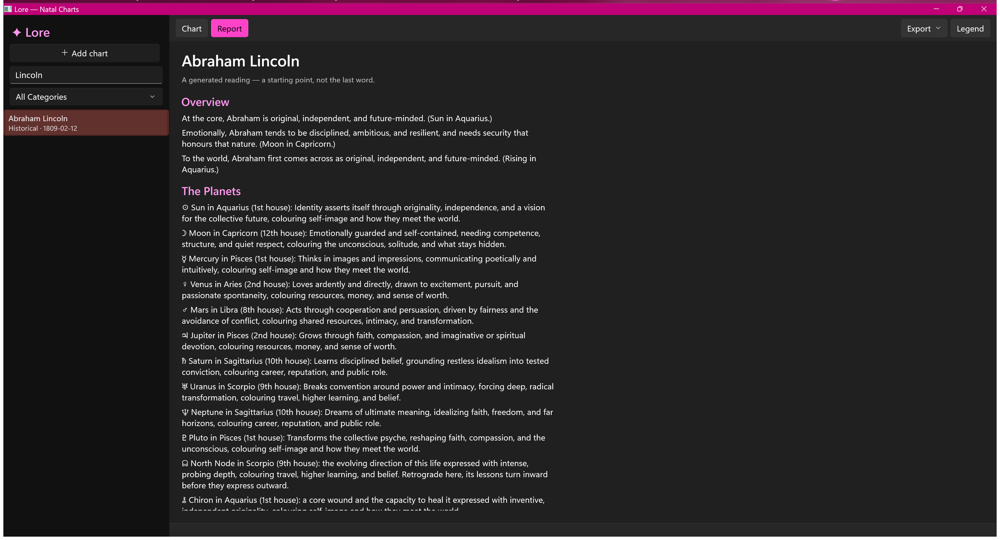

# Lore — Natal Chart Generator


> A Windows desktop application for computing and exploring astrological natal charts, powered by the Swiss Ephemeris. Browse a curated library of historical figures — every one with a documented birth time — or add your own.

**Latest release: v1.0.0** · [Download](../../releases/latest)



---

## Features

### Chart Calculation
- **Swiss Ephemeris** (`sweph.dll`) provides high-precision planetary positions for dates from 1200 CE to 2400 CE.
- Computes positions for **13 bodies**: Sun, Moon, Mercury, Venus, Mars, Jupiter, Saturn, Uranus, Neptune, Pluto, North Node, Chiron, and Black Moon Lilith (Mean Apogee).
- Calculates **12 Placidus house cusps**, Ascendant, and Midheaven.
- Detects **five major aspects** (conjunction ☌, sextile ⚹, square □, trine △, opposition ☍) with per-aspect orbs, and flags each as applying or separating.
- Retrograde detection for all five non-luminary classical planets.

- **99 figures** across **12 categories** — Actors, Musicians, Writers, Artists, Scientists, Philosophers, Political, Historical, and more.
- **Every figure has a documented, recorded birth time** (Astro-Databank / Rodden-rated). Entries without a reliable birth time were removed, so no chart relies on a noon guess.
- Each entry stores birth date, time, birth place, geographic coordinates, IANA time zone, and a one-sentence bio.
- Birth instants are resolved with **historical, DST-aware UTC offsets** via the IANA timezone database (NodaTime), not just fixed offsets — correctly handling anomalies like the UK's 1968–71 year-round BST experiment and 1940s US wartime time.

### My Charts (Custom Entry)
- **Add Chart** button opens a dialog to enter any name, date, time, and place.
- City search autofills latitude, longitude, and IANA timezone from a bundled database of ~50,250 cities.
- Custom charts persist to `%LOCALAPPDATA%\Lore\mycharts.json` and appear under a dedicated **My Charts** category.
- Custom charts can be deleted from the browse list.

### Chart Views
| View | Description |
|---|---|
| **Chart Wheel** | Rendered chart wheel (Win2D / Direct2D), drawn on-screen and exportable as a high-resolution PNG. |
| **Report** | Natural-language reading: Overview (Sun/Moon/Rising), planet-by-sign-and-house paragraphs, major aspects, and elemental balance. |
| **Legend** | Full-page reference — a grouped list of every glyph, colour, angle, house, and term; click any item for a fuller explanation. |

### Traditional Dignity Scoring
Every chart is scored against the **Lilly/Dorothean rubric**:

| Component | Factors |
|---|---|
| **Essential** | Domicile (+5), Exaltation (+4), Triplicity (+3), Detriment (−5), Fall (−4) |
| **Accidental** | House placement (Lilly's table), direct motion (+4) / retrograde (−5), solar phase: cazimi (+5) / combust (−5) / under beams (−4) |

Applied to the seven classical planets (Sun–Saturn). The aggregate score yields a verdict:
- 🟢 **Extraordinary** (≥ 31)
- ⚪ **Ordinary**
- 🔴 **Alarming** (≤ 13)

The verdict is surfaced everywhere: a coloured pill in the chart header, a **whole-row green / red wash** on notable figures in the browse list, a coloured rim on the chart wheel, and a full per-planet breakdown table in the exported PDF. Bands are calibrated against the bundled corpus so roughly a quarter read Extraordinary, a sixth Alarming, and the rest Ordinary — a fair chance of finding something notable when you look someone up.

### Export
Charts can be exported in four formats:

| Format | Contents |
|---|---|
| **PNG** | High-resolution chart wheel (1600 × 1600 px, offscreen Win2D render) |
| **PDF** | Full reading — birth data, chart wheel image, Big Three, written report, and per-planet dignity table |
| **JSON** | Structured chart data (planets, houses, aspects, angles) |
| **XML** | Same structured data in XML |

---

## Architecture

The project follows MVVM, targeting **WinUI 3** (unpackaged) on **.NET 10**.

```
Lore/
├── Models/          # Plain data types: Celebrity, NatalChart, PlanetPosition,
│                    #   Aspect, HouseCusp, ZodiacSign, DignityScore, …
├── Services/
│   ├── SwissEphemeris.cs      # P/Invoke wrapper around Native\sweph.dll
│   ├── ChartService.cs        # Orchestrates planet + house + aspect calculation
│   ├── BirthTimeResolver.cs   # UTC conversion using NodaTime + GeoTimeZone
│   ├── DignityService.cs      # Traditional dignity scoring (Lilly/Dorothean)
│   ├── ChartInterpreter.cs    # Report generation from interpretations.json corpus
│   ├── ExportService.cs       # PNG / PDF / JSON / XML export
│   ├── CelebrityService.cs    # Loads celebrities.json
│   ├── UserChartService.cs    # Loads/saves mycharts.json
│   └── CityService.cs         # City autocomplete for Add-Chart dialog
├── ViewModels/
│   ├── MainViewModel.cs       # Browse list, search/filter, category, add/delete
│   └── ChartViewModel.cs      # Chart + report state for the detail pane
├── Views/
│   ├── ChartRenderer.cs       # Win2D Direct2D chart wheel drawing
│   ├── ChartView.xaml/.cs     # Chart wheel + export controls
│   ├── ReportView.xaml/.cs    # Natural-language report display
│   ├── LegendView.xaml/.cs    # Glyph + colour legend
│   └── AddChartDialog.xaml/.cs# Custom chart entry dialog
├── Data/
│   ├── celebrities.json       # 99 bundled figures (all with recorded birth times)
│   ├── cities.json            # ~50,250 cities (lat/lon + IANA tz)
│   ├── interpretations.json   # Corpus for the natural-language report
│   └── swisseph-2.10.3bfinal/ # Swiss Ephemeris C source + .se1 ephemeris files
├── Native/
│   └── sweph.dll              # Built by Build-SwephDll.ps1 (not in repo)
├── Assets/
│   └── AppIcon.ico            # Indigo/gold "L" icon
└── scripts/
    ├── build-portable.ps1     # Self-contained portable build
    ├── build-installer.ps1    # Inno Setup installer
    ├── build-icons.ps1        # Icon generation (requires ImageMagick)
    └── build-cities.py        # Regenerate cities.json from simplemaps CSV
```

### Key Dependencies

| Package | Role |
|---|---|
| `Microsoft.WindowsAppSDK` 1.8 | WinUI 3 framework (unpackaged) |
| `Microsoft.Graphics.Win2D` | Direct2D-backed chart wheel rendering |
| `CommunityToolkit.Mvvm` 8 | Observable properties, relay commands |
| `NodaTime` 3 | Historical DST-aware UTC conversion |
| `GeoTimeZone` 5 | Offline lat/lon → IANA timezone mapping |
| `QuestPDF` 2025 | PDF generation (Community licence) |

---

## Prerequisites

- **Windows 10 version 1803** (build 17763) or later, **64-bit**
- **.NET 10 SDK** (for building from source)
- **Visual Studio 2019/2022 Build Tools** with the *Desktop development with C++* workload — required once to compile `sweph.dll`

---

## Building from Source

### Step 1 — Compile `sweph.dll` (one-time)

The Swiss Ephemeris C source is bundled in `Data\swisseph-2.10.3bfinal\`. Build the DLL from the project root:

```powershell
.\Build-SwephDll.ps1
```

This produces `Native\sweph.dll` (~600 KB). If the script cannot find Visual Studio, install the free **Build Tools for Visual Studio 2022** from https://visualstudio.microsoft.com/downloads/ and re-run.

### Step 2 — Build the App

```powershell
dotnet restore
dotnet build -c Release -r win-x64
```

Or open the project in **Visual Studio 2022 (17.11+)**.

The `.csproj` automatically copies `sweph.dll` and the required `.se1` ephemeris files to the build output; no manual file placement is needed.

### Step 3 — Portable Build

Produces a self-contained folder that runs with no installed .NET or VC++ runtime on the target machine:

```powershell
.\scripts\build-portable.ps1
```

Output: `artifacts\Lore-<version>-portable\` (e.g. `Lore-1.0.0-portable\`) — zip the whole folder and share; the recipient unzips and runs `Lore.exe` directly. (The folder is self-contained: `Lore.exe` alone will not run.)

### Step 4 — Installer

Produces a single `LoreSetup-<version>.exe` that installs Lore per-user (no admin prompt), adds a Start Menu shortcut, and registers a clean uninstall entry.

One-time: install Inno Setup:

```powershell
winget install --id JRSoftware.InnoSetup -e
```

Then:

```powershell
.\scripts\build-installer.ps1
```

Output: `artifacts\LoreSetup-<version>.exe`.

> **Note:** The installer is unsigned. Windows SmartScreen will show *"Windows protected your PC"* the first time. Click **More info → Run anyway**.

---

## Data Files

### `Data\celebrities.json`

99 figures in 12 categories, each with a documented birth time. Each entry:

```jsonc
{
  "id": "elvis-presley",
  "name": "Elvis Presley",
  "category": "Musicians",
  "birthDate": "1935-01-08",
  "birthTime": "04:35",
  "birthTimeKnown": true,
  "birthPlace": "Tupelo, Mississippi, USA",
  "latitude": 34.2576,
  "longitude": -88.7034,
  "utcOffsetHours": -6,
  "timeZoneId": "America/Chicago",
  "bio": "American singer known as the King of Rock and Roll."
}
```

`timeZoneId` (IANA zone) is preferred for historical offset resolution. `utcOffsetHours` is a fallback only. Entries without `timeZoneId` are backfilled from their coordinates at load time.

`birthTimeKnown: false` → noon is used; house cusps and the Ascendant will be unreliable.

### `Data\cities.json`

~50,250 cities with `name`, `lat`, `lon`, `tz` (IANA zone), and `utc` (standard non-DST offset). Powers the city autocomplete in the Add Chart dialog. Generated from the [simplemaps World Cities Database](https://simplemaps.com/data/world-cities) (CC BY 4.0) via `scripts\build-cities.py`.

To regenerate after updating the simplemaps download:

```powershell
pip install --user timezonefinder tzdata
python scripts\build-cities.py
```

### `Data\interpretations.json`

Editable corpus for the natural-language report. Keyed dictionaries for sign traits, role framing, planet themes, sign styles, bespoke planet-in-sign lines (`"Planet|Sign"` keys), house area descriptions, aspect dynamics, and elemental descriptions. Edit this file to customise the generated text without touching C# code.

---

## House System

Placidus is the default. To switch, change the `HouseSystem` constant in `Services\ChartService.cs`:

| Letter | System |
|---|---|
| `'P'` | Placidus *(default)* |
| `'W'` | Whole Sign |
| `'K'` | Koch |
| `'E'` | Equal |

Any letter accepted by the Swiss Ephemeris `swe_houses` function can be used.

---

## Ephemeris Coverage

| File pair | Coverage | Bodies |
|---|---|---|
| `sepl_12.se1` / `sepl_18.se1` | 1200–1800 / 1800–2400 CE | Planets |
| `semo_12.se1` / `semo_18.se1` | 1200–1800 / 1800–2400 CE | Moon |
| `seas_12.se1` / `seas_18.se1` | 1200–1800 / 1800–2400 CE | Chiron |

The `_12` files are required for historical figures such as Leonardo da Vinci, Shakespeare, Newton, and Mozart.

---

## Troubleshooting

| Symptom | Fix |
|---|---|
| *"DLL not found"* at runtime | Run `Build-SwephDll.ps1` first; verify `Native\sweph.dll` exists. |
| *"Ephemeris file not found"* / `SE_ERR` in chart | Rebuild the project; the `.csproj` copies `.se1` files to `Assets\Ephemeris\` automatically. |
| Calculation error for pre-1800 birthdays | The `_12` ephemeris files are required; check that the build output contains them in `Assets\Ephemeris\`. |

---

## Attribution & Licences

| Component | Licence |
|---|---|
| [Swiss Ephemeris](https://www.astro.com/swisseph/) | AGPL-3.0 / Astrodienst commercial licence |
| [simplemaps World Cities Database](https://simplemaps.com/data/world-cities) | CC BY 4.0 |
| [NodaTime](https://nodatime.org/) | Apache-2.0 |
| [GeoTimeZone](https://github.com/mattjohnsonpint/GeoTimeZone) | MIT |
| [QuestPDF](https://www.questpdf.com/) | Community licence (free for individuals / < $1 M revenue) |
| [CommunityToolkit.Mvvm](https://github.com/CommunityToolkit/dotnet) | MIT |
| [Microsoft.Graphics.Win2D](https://github.com/microsoft/Win2D) | MIT |

---

## Version History

### 1.0.0 (current)
- **Traditional dignity scoring** — every chart scored against the Lilly/Dorothean rubric and rated Extraordinary / Ordinary / Alarming, surfaced as a header pill, a whole-row colour wash in the browse list, a chart-wheel rim, and a per-planet table in the PDF.
- **Historical, DST-aware birth-time resolution** — birth instants converted via the IANA time zone database (NodaTime + GeoTimeZone), correctly handling historical anomalies (UK 1968–71 BST, 1940s US war time) rather than a single fixed offset.
- **Black Moon Lilith** added as a 13th body.
- **Curated, fully-timed figure library** — trimmed to figures with documented (Rodden-rated) birth times and rebalanced across categories (99 figures, 12 categories); added Scientists, Writers, Artists, Philosophers, and political/historical figures.
- **Chart wheel corrected and clarified** — standard orientation (MC at top), thicker lines, and a header that leads with the **Big Three** (Sun / Moon / Rising) so the Sun sign isn't confused with the Midheaven.
- **Full-page Legend & Reference** — click any glyph, colour, angle, house, or term for a fuller explanation (replaces the old cramped pop-up).
- **All Categories** filter option.

### 0.2
- **Add Chart** — custom chart entry with city-search autocomplete; charts persist to `mycharts.json`.
- **Legend** — explains every glyph, aspect colour, and chart angle.
- **Report view** — natural-language reading generated from an editable corpus.
- **Portable build** — self-contained, no install required.
- Application starts maximised.
