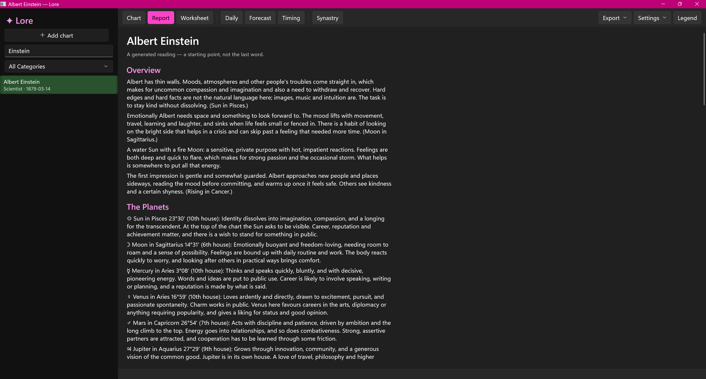
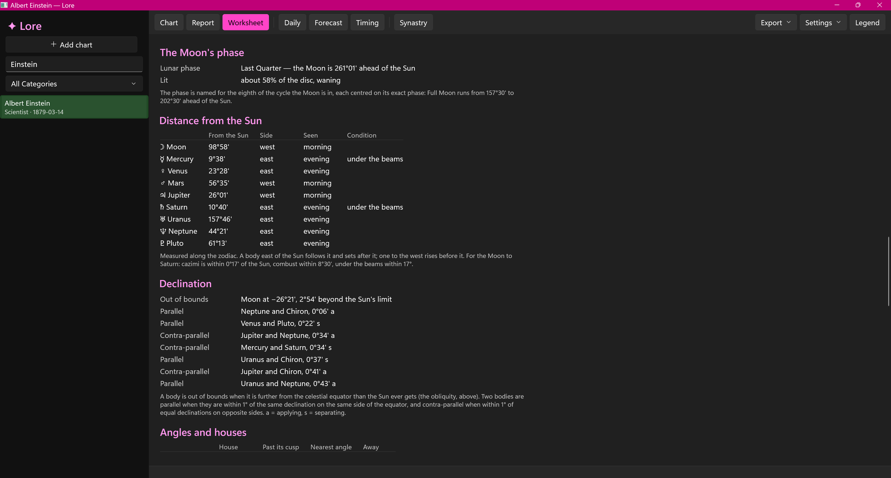
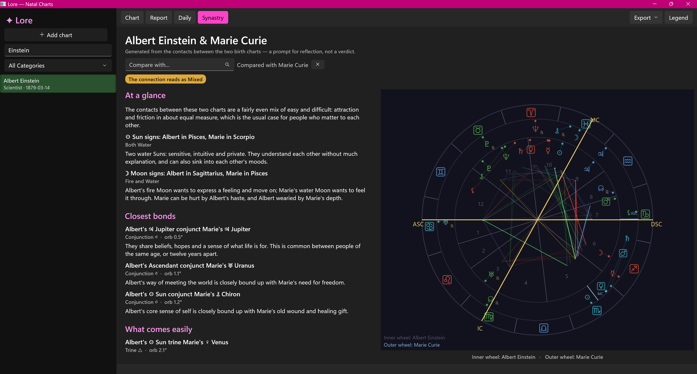
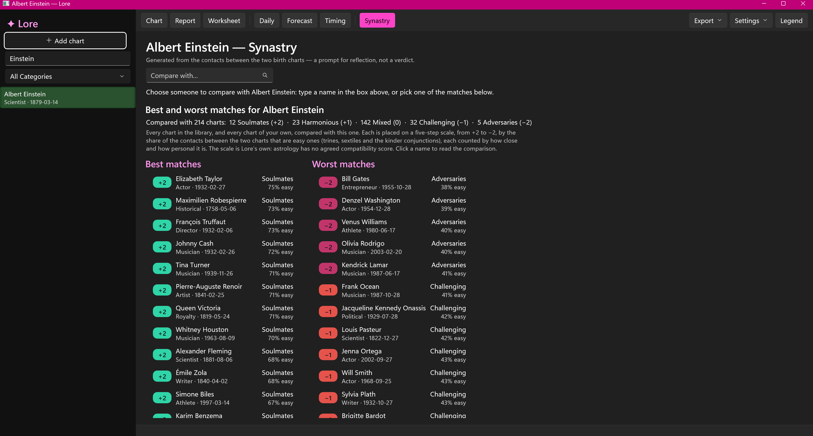

# Lore — Natal Chart Generator


> A Windows desktop application for computing and exploring astrological natal charts — and reading a daily horoscope from them — powered by the Swiss Ephemeris. Browse a curated library of historical figures — every one with a documented birth time — or add your own.

**Latest release: v2.8.0** · [Download](../../releases/latest)

### Installing

1. From the [latest release](../../releases/latest), download **`LoreSetup-2.8.0.exe`**. It is a single file with everything inside it — there is nothing to unzip and nothing else to install (no .NET, no runtimes).
2. Double-click it. It installs for the current user only (no administrator prompt), adds a Start-menu shortcut, and can be removed from *Settings → Apps* like any other program.

**Prefer not to install?** Download **`Lore-2.8.0-portable.zip`** from the same release instead, unzip it anywhere, and run `Lore.exe` from inside the unzipped folder. (Keep the folder together — `Lore.exe` will not run on its own.) Delete the folder to remove it.

> **The installer is not code-signed.** Lore is a free hobby project and does not carry a paid signing certificate, so Windows cannot verify who published it and will warn you:
> - Your browser may say the file *"isn't commonly downloaded"* — choose **Keep** (in Edge: **⋯ → Keep → Show more → Keep anyway**).
> - On first run, Windows SmartScreen shows *"Windows protected your PC"* — click **More info → Run anyway**.
>
> These warnings appear for any unsigned program, and only the first time. If you would rather not run an unsigned installer, you can [build Lore from source](#building-from-source) instead.




---

## Features

### Chart Calculation
- **Swiss Ephemeris** (`sweph.dll`) provides high-precision planetary positions for dates from 1200 CE to 2400 CE.
- Computes positions for **13 bodies**: Sun, Moon, Mercury, Venus, Mars, Jupiter, Saturn, Uranus, Neptune, Pluto, North Node (mean or true), Chiron, and Black Moon Lilith (mean or true apogee).
- Calculates the **12 house cusps** (Placidus, Whole Sign, Equal, or Koch — your choice), Ascendant, and Midheaven.
- Detects **five major aspects** (conjunction ☌, sextile ⚹, square □, trine △, opposition ☍) with per-aspect orbs, and flags each as applying or separating.
- Detects **major configurations** — stellium, grand trine, kite, T-square, grand cross, mystic rectangle and (with the minor aspects on) yod — from the positions and aspects (a T-square that is one arm of a grand cross, or a grand trine that is the body of a kite, is not reported twice).
- Retrograde detection for every planet from Mercury to Pluto, and Chiron.
- **Further points and measurements** — the South Node, Descendant, IC, Vertex and the Parts of Fortune and Spirit; the lunar phase at birth; each planet's distance from the Sun; parallels, contra-parallels and out-of-bounds planets by declination; the balance of the chart; chart ruler, house rulers and dispositors.

### Figure Library
- **1,314 figures** across **14 categories** — Actors, Musicians, Writers, Artists, Scientists, Philosophers, Directors, Athletes, Political, Historical, and more.
- **Every figure has a documented, recorded birth time** (Astro-Databank / Rodden-rated). Entries without a reliable birth time were removed, so no chart relies on a noon guess.
- Each entry stores birth date, time, birth place, geographic coordinates, IANA time zone, and a one-sentence bio.
- Birth instants are resolved with **historical, DST-aware UTC offsets** via the IANA timezone database (NodaTime), not just fixed offsets — correctly handling anomalies like the UK's 1968–71 year-round BST experiment and 1940s US wartime time. For births before standard time existed, the birthplace's own local mean time (from its longitude) is used, as astrological sources record them.

### My Charts (Custom Entry)
- **Add Chart** button opens a dialog to enter any name, date, time, and place.
- City search autofills latitude, longitude, and IANA timezone from a bundled database of ~50,250 cities. Several words narrow it down: "Springfield Illinois", "Paris France".
- **Hospital search** autofills more precise coordinates from a bundled database of ~235,000 hospitals worldwide — including former names of renamed hospitals and hospitals that have since closed — because hospitals are where people are born, and precise coordinates sharpen the Ascendant and house cusps. The timezone is derived from the chosen coordinates.
- Custom charts persist to `%LOCALAPPDATA%\Lore\mycharts.json` and appear under a dedicated **My Charts** category.
- Custom charts can be **edited** (pencil button) or **deleted** (bin button, which asks first) from the browse list.
- The **⋯** button beside them saves a copy of all your charts as one file, and brings charts in from such a copy — for a backup, or to move them to another PC. Bringing a copy in adds its charts to the ones already there; a chart that was already there (the same one, edited on either PC) is replaced by the copy's version.
- Saving is crash-safe: a save is written to a temporary file before it replaces the real one, the previous version is kept as `mycharts.json.bak`, and a file that can't be read is never overwritten — it is set aside under a dated name and the backup restored, with a note in the status bar.

### Chart Views
| View | Description |
|---|---|
| **Chart Wheel** | Rendered chart wheel (Win2D / Direct2D), drawn on-screen and exportable as a high-resolution PNG. |
| **Report** | Natural-language reading: Overview (Sun/Moon/Rising), planet-by-sign-degree-and-house paragraphs, major aspects, chart patterns (stellium, grand trine, kite, T-square, grand cross, mystic rectangle, yod), and elemental and modal balance. The Ascendant/Midheaven line shows their degrees and names the house system. |
| **Worksheet** | The numbers behind the chart, uninterpreted: how the birth time became Universal Time, every position to the arc-second with latitude, declination, daily speed and house, the twelve house cusps, the derived points (South Node, Descendant, IC, Vertex and Anti-Vertex, Parts of Fortune and Spirit), and a grid of every aspect — including those to the Ascendant, Midheaven, Vertex and the two lots — with orb and applying/separating. Below that come the further measurements: the Moon's phase and age and the New and Full Moon before birth, each planet's distance from the Sun, its speed beside its average and its nearest station, its right ascension, distance, altitude and azimuth, declination contacts and out-of-bounds planets, closeness to the angles, the balance of the chart by element, mode, polarity, house and quadrant and how widely the planets are spread, a weighted reckoning of which planet and which signs dominate, the aspects in sum, midpoints, antiscia, and the chart's rulers, dispositors, triplicity rulers and almutens. The top of the Worksheet also gives the Julian day, the Sun's height above or below the horizon, and the planetary day and hour of birth. A section headed *If the birth time is off* shows what would change, and when, if the recorded time were out by a margin you set. |
| **Daily** | Daily horoscope for the selected chart on any date — generated from that day's transits, with a wheel of the day's sky around the birth chart. See below. |
| **Forecast** | The transits coming up for the selected chart over the next month to a year: when each comes into orb, is exact, and leaves, with the Daily view's written line for it. Set among them, if you wish, is the sky's own calendar: New and Full Moons, eclipses, planets turning retrograde or direct, and the slow planets changing sign, each with the house of the chart it falls in. |
| **Timing** | The solar return in force on a date, with its wheel, cast for the birthplace or for any city you choose; the annual profection (the house, sign and Lord of the Year); the chart progressed to that date a day for a year; the chart directed by solar arc; and, when another city is chosen, the birth chart relocated there. |
| **Synastry** | The selected chart compared with a second person's: a written reading and a bi-wheel of the two charts. See below. |
| **Legend** | Full-page reference — a grouped list of every glyph, colour, angle, house, and term; click any item for a fuller explanation. |



### Daily Horoscope
The **Daily** view writes a horoscope for the selected chart, for today or any date you step to, from that day's **transits** — the aspects the moving planets make to the fixed points of the birth chart.

- **Whole-day scan.** The sky is sampled across the local calendar day (midnight to midnight in your own time zone, so 23- and 25-hour daylight-saving days come out right) and each contact is refined to its exact time. A single noon or midnight snapshot would miss lunar contacts that form and pass in between.
- **All thirteen bodies, both ways.** Sun through Pluto plus the North Node, Chiron, and Lilith are tracked as movers, against the same thirteen natal positions plus the Ascendant and Midheaven — including each body's return to its own natal place (solar return, Saturn return, and so on).
- **A tight 1° orb** (against 6–8° natally), so a transit marks particular days rather than a whole season.
- **Foreground and background.** Fast movers (Sun–Mars) make up *Today's highlights*; slow movers (Jupiter outward, and the slow points) make up *Longer-running themes*, each marked as building, exact, or easing with the date it peaks.
- **The day at a glance.** Moon sign and phase (with sign changes and exact New/Quarter/Full Moons timed), the natal houses the Moon and Sun are passing through, retrogrades and stations, and an overall **day tone** — Flowing, Mixed, Demanding, Focused, or Quiet.
- **Deterministic and offline.** The same chart and date always give the same reading. Every sentence comes from an editable corpus (`Data\daily.json`, 585 bespoke transit lines); nothing is generated at run time.
- **Explainable.** *Why this reading?* lists every transit in effect that day, how close it gets, and which ones the reading used.
- **Honest about unknowns.** For a chart with no birth time, the houses, angles, and contacts to the natal Moon are left out rather than read from a noon guess.
- **Void-of-course Moon.** When the Moon has made its last aspect in a sign and not yet entered the next, the reading gives the hours on your clock, the aspect that began the stretch and the sign that ends it.
- **Planetary hours.** Choose your city under **Settings → Where you are** and the reading ends with the day's ruling planet, sunrise and sunset there, and the twelve planetary hours of the day and of the night on your clock. The place is kept on your PC and used for nothing else.
- **Transit wheel.** Beside the reading, the birth chart drawn inside and the moving planets (as they stand at the middle of the day) in a band around it, with each transit as an aspect line; the ones the reading uses are drawn heavier.

It is a prompt for reflection, not a prediction: the ranking of transits is an editorial priority, not a probability.

### Synastry
The **Synastry** view compares the selected chart with a second person's — any bundled figure or any of your own charts, chosen in the **Compare with…** box.



- **Every contact between the two charts.** Each person's thirteen bodies, Ascendant, and Midheaven are tried against the other's, within a **6° orb** (4° for a sextile) — a little tighter than the 8°/6° used inside one chart.
- **A short, ranked reading.** *Closest bonds* (up to three conjunctions), *What comes easily* (up to four trines and sextiles), and *What takes work* (up to four squares and oppositions), chosen by closeness and by how personal the points are. Contacts between two slow planets, shared by everyone born in the same years, are listed but not written up.
- **At a glance.** The two Sun signs and Moon signs compared by element, and an overall tone on a five-step scale (see below).
- **House overlays.** Where each person's Sun, Moon, Venus, and Mars fall in the other's houses.
- **Davison chart.** The reading ends with the chart for the moment and place halfway between the two births: when and where it is cast for, and where everything stands in it. Stated, not interpreted.
- **Bi-wheel.** The selected chart drawn inside, the second person's planets in a band around it on the same zodiac, with the contacts between them as aspect lines (the ones the reading uses drawn heavier).
- **Deterministic and offline.** Every sentence comes from an editable corpus (`Data\synastry.json`): 144 bespoke lines for the pairs that matter most, and assembled sentences for the rest.
- **Explainable.** *Why this reading?* lists every contact found and which ones the reading used.
- **Honest about unknowns.** A chart with no birth time contributes no Ascendant, Midheaven, houses, or Moon.

- **Best and worst matches.** Before you choose anyone, the view compares the selected chart with every figure in the library and every chart of your own, and lists the twelve best and twelve worst matches. Click one to read the comparison.
- **A five-step scale.** Each pair is placed at **Soulmates** (+2), **Harmonious** (+1), **Mixed** (0), **Challenging** (−1) or **Adversaries** (−2), by the share of the contacts between the two charts that are easy ones, each counted by how close and how personal it is. The steps are set against every pair in the library, so about half of all pairs are Mixed and about one in fourteen falls at each end.



Astrology has no agreed compatibility score; the scale is Lore's own, and it describes the symbolism between two charts rather than forecasting a relationship.

### Traditional Dignity Scoring
Every chart is scored against the **Lilly/Dorothean rubric**:

| Component | Factors |
|---|---|
| **Essential** | Domicile (+5), Exaltation (+4), Triplicity (+3), Term (+2), Face (+1), Detriment (−5), Fall (−4), Peregrine (−5) |
| **Accidental** | House placement (Lilly's table), direct motion (+4) / retrograde (−5), solar phase: cazimi (+5) / combust (−5) / under beams (−4) |

Applied to the seven classical planets (Sun–Saturn). The aggregate score yields a verdict:
- 🟢 **Extraordinary** (29 or more)
- ⚪ **Ordinary**
- 🔴 **Alarming** (−2 or less)

The verdict is surfaced everywhere: a coloured pill in the chart header, a **whole-row green / red wash** on notable figures in the browse list, a coloured rim on the chart wheel, and a full per-planet breakdown table in the exported PDF. Bands are calibrated against the bundled corpus so roughly a quarter read Extraordinary, a sixth Alarming, and the rest Ordinary — a fair chance of finding something notable when you look someone up.

### Export
Charts and readings can be exported in these formats:

| Format | Contents |
|---|---|
| **PNG** | High-resolution chart wheel (1600 × 1600 px, offscreen Win2D render) |
| **PNG — chart with tables** | The wheel with the Worksheet set out around and under it in one image (2400 px wide): birth data and settings, every position, the house cusps, the aspect grid, elements by mode, the Moon's phase, balance, rulers, declination, distance from the Sun, motion and stations, equator and horizon, dispositors, midpoints, almutens, the dignity score by planet, and a strip ordering everything by degree |
| **PDF** | Full reading — birth data, chart wheel image, Big Three, written report, per-planet dignity table, and the worksheet |
| **JSON** | Structured chart data (planets, houses, aspects, angles, detected patterns, and every Worksheet measurement, including the dignity score's breakdown) |
| **XML** | Same structured data in XML |
| **Text — worksheet** | The Worksheet view as plain text, for pasting into notes or checking against another program |
| **PDF / Text — daily horoscope** | The daily reading for the date shown in the Daily view, with the full list of that day's transits; the PDF includes the transit wheel |
| **PNG — daily transit wheel** | The Daily view's wheel alone (1600 × 1600 px) |
| **PDF / Text — forecast** | The transits ahead for the period shown in the Forecast view, month by month, with the sky calendar among them if it is switched on |
| **PDF / Text — solar return and progressions** | The Timing view's whole reading for its date (solar return, profection, progressions, solar arc and any relocation); the PDF includes the return chart's wheel |
| **PDF — synastry reading** | The synastry reading on screen, with the bi-wheel and the full list of contacts between the two charts |
| **PNG — synastry bi-wheel** | The bi-wheel alone (1600 × 1600 px) |

---

## Architecture

The project follows MVVM, targeting **WinUI 3** (unpackaged) on **.NET 10**.

```
Lore/
├── Models/          # Plain data types: Celebrity, NatalChart, PlanetPosition,
│                    #   Aspect, HouseCusp, ZodiacSign, DignityScore, …
├── Services/
│   ├── SwissEphemeris.cs      # P/Invoke wrapper around Native\sweph.dll
│   ├── SettingsService.cs     # House system / node type, saved to settings.json
│   ├── WorksheetService.cs    # The Worksheet view's tables and its text export
│   ├── NatalMetricsService.cs # Further measurements: derived points, lunar phase, declination, balance, rulers
│   ├── TimeSensitivityService.cs # "If the birth time is off": what holds and what changes across a margin
│   ├── ChartService.cs        # Orchestrates planet + house + aspect calculation
│   ├── BirthTimeResolver.cs   # UTC conversion using NodaTime + GeoTimeZone
│   ├── DignityService.cs      # Traditional dignity scoring (Lilly/Dorothean)
│   ├── ChartInterpreter.cs    # Report generation from interpretations.json corpus
│   ├── TransitService.cs      # Daily horoscope, astronomy: a day's transits to a natal chart
│   ├── DailyInterpreter.cs    # Daily horoscope, wording: rank, select, compose from daily.json
│   ├── DailyExportService.cs  # Daily horoscope PDF / text export
│   ├── SynastryService.cs     # Synastry, astronomy: aspects and house overlays between two charts
│   ├── SynastryInterpreter.cs # Synastry, wording: rank, select, compose from synastry.json
│   ├── SynastryScoring.cs     # Synastry, weighing: the five-step scale and the best/worst match search
│   ├── SynastryExportService.cs # Synastry PDF export
│   ├── ExportService.cs       # PNG / PDF / JSON / XML export
│   ├── CelebrityService.cs    # Loads celebrities.json
│   ├── UserChartService.cs    # Loads/saves mycharts.json
│   ├── CityService.cs         # City autocomplete for Add-Chart dialog
│   └── HospitalService.cs     # Hospital autocomplete for Add-Chart dialog
├── ViewModels/
│   ├── MainViewModel.cs       # Browse list, search/filter, category, add/delete
│   ├── ChartViewModel.cs      # Chart + report state for the detail pane
│   ├── DailyViewModel.cs      # Daily horoscope state: chart, date, generated reading
│   └── SynastryViewModel.cs   # Synastry state: chart, partner, generated reading
├── SplashWindow.xaml/.cs      # Launch splash: artwork + "Lore <version>", up while data loads
├── Views/
│   ├── ChartRenderer.cs       # Win2D Direct2D chart wheel drawing
│   ├── ChartView.xaml/.cs     # Chart wheel + export controls
│   ├── ReportView.xaml/.cs    # Natural-language report display
│   ├── DailyView.xaml/.cs     # Daily horoscope with date navigation
│   ├── SynastryView.xaml/.cs  # Synastry reading, partner picker, and bi-wheel
│   ├── LegendView.xaml/.cs    # Glyph + colour legend
│   └── AddChartDialog.xaml/.cs# Custom chart entry dialog
├── Data/
│   ├── celebrities.json       # 1,314 bundled figures (all with recorded birth times)
│   ├── cities.json            # ~50,250 cities (lat/lon + IANA tz)
│   ├── hospitals.json         # ~235,000 hospitals (lat/lon), Add-Chart birthplace search
│   ├── interpretations.json   # Corpus for the natural-language report
│   ├── daily.json             # Corpus for the daily horoscope (transit lines, Moon/Sun/house text)
│   ├── synastry.json          # Corpus for the synastry reading (aspect lines, element and house text)
│   └── swisseph-2.10.3bfinal/ # Swiss Ephemeris C source + .se1 ephemeris files
├── Native/
│   └── sweph.dll              # Built by Build-SwephDll.ps1 (not in repo)
├── tests/
│   └── Lore.Tests/            # xUnit tests: calculations, transits, saved charts, figures vs Astro-Databank
├── Assets/
│   ├── AppIcon.ico            # Indigo/gold "L" icon
│   └── splash.png             # Splash-screen artwork (name + version drawn over it at launch)
└── scripts/
    ├── build-portable.ps1     # Self-contained portable build
    ├── build-installer.ps1    # Inno Setup installer
    ├── build-icons.ps1        # Icon generation (requires ImageMagick)
    ├── build-cities.py        # Regenerate cities.json from simplemaps CSV
    ├── build-swetest-reference.py # Regenerate the swetest comparison values for the tests
    ├── build-hospitals.bat    # Double-click pipeline: rebuild hospitals.json
    ├── build-hospitals.py     # Stage 2: merge Wikidata CSV + OpenStreetMap -> hospitals.json
    └── wikidata_hospitals.py  # Stage 1: query Wikidata -> hospitals_wikidata.csv
```

### Key Dependencies

| Package | Role |
|---|---|
| `Microsoft.WindowsAppSDK` 1.8 | WinUI 3 framework (unpackaged) |
| `Microsoft.Graphics.Win2D` | Direct2D-backed chart wheel rendering |
| `CommunityToolkit.Mvvm` 8 | Observable properties, relay commands |
| `NodaTime` 3 | Historical DST-aware UTC conversion |
| `GeoTimeZone` 5 | Offline lat/lon → IANA timezone mapping |
| `QuestPDF` 2025 | PDF generation (Community licence) |

---

## Prerequisites

- **Windows 10 version 1809** (build 17763) or later, **64-bit**
- **.NET 10 SDK** (for building from source)
- **Visual Studio 2019/2022 Build Tools** with the *Desktop development with C++* workload — required once to compile `sweph.dll`

---

## Building from Source

### Step 1 — Compile `sweph.dll` (one-time)

The Swiss Ephemeris C source is bundled in `Data\swisseph-2.10.3bfinal\`. Build the DLL from the project root:

```powershell
.\Build-SwephDll.ps1
```

This produces `Native\sweph.dll` (~600 KB). If the script cannot find Visual Studio, install the free **Build Tools for Visual Studio 2022** from https://visualstudio.microsoft.com/downloads/ and re-run.

### Step 2 — Build the App

```powershell
dotnet restore
dotnet build -c Release -r win-x64
```

Or open the project in **Visual Studio 2022 (17.11+)**.

The `.csproj` automatically copies `sweph.dll` and the required `.se1` ephemeris files to the build output; no manual file placement is needed.

#### Running the tests

```powershell
dotnet test tests\Lore.Tests
```

The tests cover the parts that must stay right: birth-time resolution (daylight saving, local mean time, historical city times), planet and Ascendant positions checked against Astro-Databank's published values, the daily transit scan checked against an independent calculation, the daily-horoscope corpus and wording, synastry (the contacts found between two charts, and the corpus and wording of the reading), crash-safe saving of My Charts (including recovery from a damaged file), and hospital search. `FigureLibraryTests` checks every bundled figure against its Astro-Databank record in `tests\Lore.Tests\Reference\adb-reference.json`: each well-documented (AA/A) birth time must match, and Lore must turn it into the same instant Astro-Databank does. Run them after editing `Data\celebrities.json`.

`SwetestReferenceTests` checks Lore against **swetest**, the Swiss Ephemeris's own command-line program, for fourteen moments and places chosen to be awkward: both ephemeris files and the seam between them, both hemispheres, the equator, the date line, and both polar circles. Every body's longitude, latitude, speed and declination, the Ascendant and Midheaven, and all twelve cusps under each of the four house systems must agree to a millionth of a degree. Because the two share an engine this checks that Lore asks it the right question, not the astronomy itself (the Astro-Databank comparison does that). The expected values live in `tests\Lore.Tests\Reference\swetest-reference.json`; `python scripts\build-swetest-reference.py` regenerates them (it needs `swetest64.exe` from the full Swiss Ephemeris download).

### Step 3 — Portable Build

Produces a self-contained folder that runs with no installed .NET or VC++ runtime on the target machine:

```powershell
.\scripts\build-portable.ps1
```

Output: `artifacts\Lore-<version>-portable\` (e.g. `Lore-2.8.0-portable\`) — zip the whole folder and share; the recipient unzips and runs `Lore.exe` directly. (The folder is self-contained: `Lore.exe` alone will not run.)

### Step 4 — Installer

Produces a single `LoreSetup-<version>.exe` that installs Lore per-user (no admin prompt), adds a Start Menu shortcut, and registers a clean uninstall entry.

One-time: install Inno Setup:

```powershell
winget install --id JRSoftware.InnoSetup -e
```

Then:

```powershell
.\scripts\build-installer.ps1
```

Output: `artifacts\LoreSetup-<version>.exe`.

> **Note:** The installer is unsigned, so Windows will warn about it the first time — see [Installing](#installing). The `.exe` is complete on its own; it does not need to be zipped with anything else to be shared.

---

## Data Files

### `Data\celebrities.json`

1,314 figures in 14 categories, each with a documented birth time (Astro-Databank Rodden rating AA or A). Each entry:

```jsonc
{
  "id": "elvis-presley",
  "name": "Elvis Presley",
  "category": "Musicians",
  "birthDate": "1935-01-08",
  "birthTime": "04:35",
  "birthTimeKnown": true,
  "birthPlace": "Tupelo, Mississippi, USA",
  "latitude": 34.2576,
  "longitude": -88.7034,
  "utcOffsetHours": -6,
  "timeZoneId": "America/Chicago",
  "roddenRating": "AA",
  "source": "Astro-Databank: birth certificate or record in hand",
  "bio": "American singer known as the King of Rock and Roll."
}
```

`timeZoneId` (IANA zone) is preferred for historical offset resolution. `utcOffsetHours` is a fallback only. Entries without `timeZoneId` are backfilled from their coordinates at load time.

38 figures also carry `"utcOffsetFixed": true`. For them `utcOffsetHours` is used as it stands, because Astro-Databank records a clock standard for that town on that day which the time-zone database does not have (mostly American towns before 1967, when daylight saving was a local matter, and wartime Europe). They are listed in `scripts\celebrity-expansion-2026-10-07.md`.

`birthTimeKnown: false` → the planets are placed for noon, and the Ascendant, Midheaven, houses and dignity score are left out.

`utcOffsetFixed: true` (My Charts only) → `utcOffsetHours` is used as given and the time zone is ignored.

### `Data\cities.json`

~50,250 cities with `name`, `lat`, `lon`, `tz` (IANA zone), and `utc` (standard non-DST offset). Powers the city autocomplete in the Add Chart dialog. Generated from the [simplemaps World Cities Database](https://simplemaps.com/data/world-cities) (CC BY 4.0) via `scripts\build-cities.py`.

To regenerate after updating the simplemaps download:

```powershell
pip install --user timezonefinder tzdata
python scripts\build-cities.py
```

### `Data\hospitals.json`

Hospitals with `name`, `city`, `country`, `lat`, and `lon`. Powers the hospital autocomplete in the Add Chart dialog, an alternative to city search that gives more precise birthplace coordinates. Unlike `cities.json` there is no timezone or population field: the app resolves the historical, DST-aware zone from the chosen coordinates (GeoTimeZone + NodaTime), and prefix search ranks by name.

Built from several merged sources by a two-stage pipeline:

- **Stage 1 — Wikidata** (`scripts\wikidata_hospitals.py` → `Data\hospitals_wikidata.csv`, columns `Hospital,City,Country,Latitude,Longitude`, CC0 1.0) — ~26,400 curated hospitals. This set is *notability-filtered*: it holds only hospitals with a Wikidata item, so it misses most small or local hospitals. The CSV is committed to the repo, so Stage 1 rarely needs re-running.
- **Stage 2 — OpenStreetMap** (`scripts\build-hospitals.py`) via the [Overpass API](https://dev.overpass-api.de/overpass-doc/) (© OpenStreetMap contributors, ODbL) — merges the Wikidata CSV with every `amenity=hospital` / `healthcare=hospital` feature worldwide, fetched one country at a time so each row is labelled with the country whose administrative boundary the query used. Adds the small local hospitals Wikidata lacks.
- **Older hospitals** (also Stage 2; leave out with `--no-history`). Most users were born decades ago, often in hospitals that have since been renamed or closed, so the build also adds:
  - **Former names** of today's hospitals — OpenStreetMap's `old_name` / `was:name` tags and Wikidata's aliases and dated former official names — each as its own searchable entry at the hospital's location, e.g. *Waterford Regional Hospital (now University Hospital Waterford)*.
  - **Former hospitals** in OpenStreetMap — buildings tagged `disused:`, `abandoned:`, `was:` or `historic:amenity=hospital`, or `historic=hospital` — labelled *(former hospital)*.
  - **[OpenHistoricalMap](https://www.openhistoricalmap.org/)** (CC0), OpenStreetMap's historical sister project, whose hospitals carry opening and closing years, e.g. *Adelaide Hospital (1839–1998)*.

Everything is merged and de-duplicated (same name within ~111 m collapses; Wikidata's curated country label wins ties). Entries with no town get the nearest one from `Data\cities.json` (within 25 km), and entries with no country get that town's country. Both scripts use only the Python standard library — no `pip install`.

#### The easy way: double-click `scripts\build-hospitals.bat`

It self-updates (`git pull --ff-only`), then offers three options:

1. **Quick build** — merge the committed Wikidata CSV with OpenStreetMap and the older-hospital sources (Stage 2 only). Recommended. The whole world takes an hour or more on the busy public servers.
2. **Full refresh** — re-download the Wikidata list (Stage 1), then merge OpenStreetMap (Stage 2). Slow (30+ minutes).
3. **Offline** — rebuild from the committed Wikidata CSV only, no network.

Options 1 and 2 then ask which countries to pull from OpenStreetMap. Leave it **blank for the whole world** (slow; resumes from cache if a busy server interrupts it), or type one or more codes such as `US` or `US,CA,GB` to fetch just those — a single country is one quick, reliable query, the fastest way to add local hospitals for one place.

After it finishes, commit and push `Data\hospitals.json`; the app needs no code changes.

#### The manual way

```powershell
# Stage 2 only (uses the committed CSV):
python scripts\build-hospitals.py                 # Wikidata + all countries (needs network)
python scripts\build-hospitals.py --countries US,GB,DE
python scripts\build-hospitals.py --no-osm        # Wikidata CSV only, no network
python scripts\build-hospitals.py --no-history    # current hospitals only (no former names / closed hospitals)

# Stage 1 (refresh the Wikidata CSV first), then Stage 2:
python scripts\wikidata_hospitals.py -o Data\hospitals_wikidata.csv --checkpoint Data\.wikidata_progress.json
python scripts\build-hospitals.py
```

The OSM fetch caches each country's result under `Data\.osm_cache\` (gitignored), so a re-run or an interrupted run resumes instead of refetching; pass `--refresh` to ignore the cache. Public Overpass servers are often busy and answer with `504`/`429`; the script treats those as transient, backs off, and rotates across several mirrors automatically, so just re-running the build picks up any countries that failed. Pin a single server with `--endpoint` or the `OVERPASS_URL` environment variable.

> The **OECD** data API cannot feed this file: it is a *statistics* store (GDP, prices, health aggregates such as beds-per-1,000), with no directory of individual hospitals and coordinates.

### `Data\daily.json`

Editable corpus for the daily horoscope. Edit it to change what the Daily view says without touching C# code.

- `transits` — 585 bespoke lines keyed `Mover|Tone|Target`, e.g. `"Mars|Tension|Midheaven"`. *Mover* is the planet moving today, *Target* the natal point it touches (any of the thirteen bodies, `Ascendant`, or `Midheaven`), and *Tone* is `Conjunction`, `Flow` (sextile or trine), or `Tension` (square or opposition). The key is directional: `Saturn|Tension|Mercury` (weeks of pressure on your thinking) and `Mercury|Tension|Saturn` (one serious-minded day) are different lines.
- `moverThemes`, `toneLinks`, `targetThemes` — building blocks used to assemble a plainer sentence for any pair whose bespoke line is missing or empty.
- `moonInSign`, `moonInHouse`, `sunInHouse`, `moonPhases`, `houses` — the "day at a glance" text.
- `dayTones`, `retrogrades`, `stations`, `notes` — the overall tone sentence, retrograde and station notes, and the quiet-day, void-of-course and unknown-birth-time messages.
- `planetaryDays` — one line for each of the seven planets, on what its day of the week is traditionally for; `notes.planetaryHours` explains the hours themselves.
- `calendar` — the Forecast's sky calendar: one line each for a solar eclipse, a lunar eclipse, a planet turning `Retrograde` or `Direct`, and a slow planet's `Ingress` into a sign (or `IngressRetrograde`, back into the one before). `{planet}` and `{sign}` are filled in. New and Full Moons use the `moonPhases` lines.

Names must match the app's display names (`North Node`, not `NorthNode`). The orb, the number of transits shown, and the ranking weights are constants in `Services\TransitService.cs` and `Services\DailyInterpreter.cs`.

### `Data\synastry.json`

Editable corpus for the synastry reading. Edit it to change what the Synastry view says without touching C# code.

- `aspects` — 144 bespoke lines keyed `Point|Tone|Point`, e.g. `"Venus|Tension|Mars"`. *Tone* is `Conjunction`, `Flow`, or `Tension`, as in `daily.json`. The two points are always written in the app's standard order (Sun, Moon, Mercury, Venus, Mars, Jupiter, Saturn, Uranus, Neptune, Pluto, North Node, Chiron, Lilith, Ascendant, Midheaven), so each pair has one line: `Sun|Flow|Moon`, never `Moon|Flow|Sun`. In the text, `{a}` is the person who owns the first-named point and `{b}` the person who owns the second; Lore fills in their first names. Covered: every pair among the Sun, Moon, Mercury, Venus, Mars, Jupiter, Saturn, and Ascendant, plus the Sun, Moon, Venus, and Mars with Uranus, Neptune, and Pluto.
- `pointThemes`, `toneLinks` — building blocks used to assemble a plainer sentence for any other pair, or one whose bespoke line is empty.
- `sunElements`, `moonElements` — the two Sun (or Moon) signs compared by element, keyed `Element|Element` in the order Fire, Earth, Air, Water.
- `overlayHouses`, `overlayPlanets`, `houses` — one person's planets in the other's houses; `{guest}` owns the planets, `{host}` the house.
- `tones`, `notes` — the overall tone sentence for each step of the scale (`Soulmates`, `Harmonious`, `Mixed`, `Challenging`, `Adversaries`, and `Light` for two charts with no contacts), the unknown-birth-time messages, and the two lines that introduce the Davison chart.

The orbs, the number of contacts shown, and the ranking weights are constants in `Services\SynastryService.cs`, `Services\SynastryScoring.cs` and `Services\SynastryInterpreter.cs`.

### `Data\interpretations.json`

Editable corpus for the natural-language report. Edit it to change what the Report view says without touching C# code.

- `sunSigns`, `moonSigns`, `risingSigns` — the Overview paragraphs, one per sign, with `{name}` for the first name. `sunMoonBlend`, keyed `SunElement|MoonElement`, says how the two fit together.
- `planetInSign` — 156 lines keyed `Planet|Sign`, and `planetInHouse` — 156 sentences keyed `Planet|House` (`"Venus|7"`), which follow them when the birth time is known. `retrogrades` adds a line for a planet that was retrograde at birth.
- `aspects` — 307 bespoke lines keyed `Point|Tone|Point`, e.g. `"Moon|Tension|Saturn"`, with *Tone* as in `daily.json` and the two points in the app's standard order, as in `synastry.json`. Every pair among the thirteen bodies, and each body with the Ascendant and Midheaven. `aspectDynamics` supplies the opening words ("flows easily with"); `aspectNotes` is the general line used for the minor aspects.
- `stelliumSigns`, `grandTrines`, `tSquares`, `grandCrosses`, `apexPoints` — what each chart pattern means in that sign, element or mode, and with that planet at its apex.
- `elements`, `elementStrong`, `elementWeak`, `modalities`, `modalityStrong`, `modalityWeak`, `balanceNotes` — the two balance sections.
- `signTraits`, `roleFraming`, `planetThemes`, `signStyles`, `houseAreas`, `angleThemes`, `aspectToneLinks` — building blocks, used to assemble a plainer sentence wherever a bespoke entry is missing or empty.

Names must match the app's display names (`North Node`, not `NorthNode`).

---

## Calculation Settings

The **Settings** button in the toolbar holds the choices astrologers disagree on. They apply to every chart, the daily horoscope and synastry, are remembered between sessions (`%LOCALAPPDATA%\Lore\settings.json`), and are named on each chart and in every export.

| Setting | Choices |
|---|---|
| **House system** | Placidus *(default)*, Whole Sign, Equal, Koch |
| **North Node** | Mean node *(default)*, True node |
| **Aspect orbs** | Standard *(default: 8°, sextile 6°)*, Tight, Wide, or your own figure for each aspect, with an optional extra for the Sun and Moon |

Changing the house system moves no planet and neither angle — only which house each planet falls in, and so the house part of the dignity score. Whether a chart is a day or night chart is taken from the Sun's position above or below the horizon, so it is the same under every system.

Inside the polar circles Placidus and Koch cannot be calculated; the chart then shows Porphyry houses and says so.

---

## Ephemeris Coverage

| File pair | Coverage | Bodies |
|---|---|---|
| `sepl_12.se1` / `sepl_18.se1` | 1200–1800 / 1800–2400 CE | Planets |
| `semo_12.se1` / `semo_18.se1` | 1200–1800 / 1800–2400 CE | Moon |
| `seas_12.se1` / `seas_18.se1` | 1200–1800 / 1800–2400 CE | Chiron |

The `_12` files are required for historical figures such as Leonardo da Vinci, Shakespeare, Newton, and Mozart.

---

## Troubleshooting

| Symptom | Fix |
|---|---|
| *"DLL not found"* at runtime | Run `Build-SwephDll.ps1` first; verify `Native\sweph.dll` exists. |
| *"Ephemeris file not found"* / `SE_ERR` in chart | Rebuild the project; the `.csproj` copies `.se1` files to `Assets\Ephemeris\` automatically. |
| Calculation error for pre-1800 birthdays | The `_12` ephemeris files are required; check that the build output contains them in `Assets\Ephemeris\`. |

---

## Attribution & Licences

Lore itself is free software under the **GNU Affero General Public License v3.0** — see [`LICENSE`](LICENSE). (The Swiss Ephemeris it is built on is offered under the same licence.)

| Component | Licence |
|---|---|
| [Swiss Ephemeris](https://www.astro.com/swisseph/) | AGPL-3.0 / Astrodienst commercial licence |
| [simplemaps World Cities Database](https://simplemaps.com/data/world-cities) | CC BY 4.0 |
| [Wikidata](https://www.wikidata.org/) (hospital coordinates) | CC0 1.0 |
| [OpenStreetMap](https://www.openstreetmap.org/copyright) (hospital coordinates) | ODbL |
| [OpenHistoricalMap](https://www.openhistoricalmap.org/) (historical hospitals) | CC0 1.0 |
| [NodaTime](https://nodatime.org/) | Apache-2.0 |
| [GeoTimeZone](https://github.com/mattjohnsonpint/GeoTimeZone) | MIT |
| [QuestPDF](https://www.questpdf.com/) | Community licence (free for individuals / < $1 M revenue) |
| [CommunityToolkit.Mvvm](https://github.com/CommunityToolkit/dotnet) | MIT |
| [Microsoft.Graphics.Win2D](https://github.com/microsoft/Win2D) | MIT |

---

## Version History

### 2.8.0 (current)
More measurements on the Worksheet, two more chart patterns, and a second round of repairs.

**New on the Worksheet** (all of it in the text, PDF, JSON and XML exports too; the Legend explains each):
- **Motion and stations** — each planet's speed beside its traditional average (swift or slow, Sun to Saturn), its motion in latitude and declination, and how many days before or after birth it last stood still or next will.
- **Equator and horizon** — right ascension, distance from the Earth, and, with a birth time, each body's altitude and compass bearing at the birthplace. The Sun's height above or below the horizon is given beside *Sect*.
- **The Moon before birth** — the Moon's age in days, and the New Moon and Full Moon before birth with their dates and degrees, marked if either was an eclipse.
- **Planetary day and hour** of birth, counted from sunrise at the birthplace.
- **Midpoints** — every point standing within 1° of the midpoint of two others, and the Sun/Moon midpoint.
- **Antiscia** — each body's antiscion and contra-antiscion, and any other body within 1° of them.
- **Almutens and triplicity rulers** — the planet with most rulership over the Sun, Moon, Ascendant, Midheaven and Part of Fortune, and the three triplicity rulers of every body's sign.
- **More of the balance** — counts by quadrant and house by house, and the spread: the smallest arc of the zodiac that holds all ten planets.
- **Smaller additions** — the Julian day, the Anti-Vertex, and aspects to the Part of Spirit in the aspect grid.
- **JSON and XML catch up** — they now carry the aspects to the Vertex and the two lots and the North Node and Lilith of the kind not in use, which until now were on the Worksheet only.

**In the Report:**
- **Kite and mystic rectangle** are detected and described. A grand trine that is the body of a kite is told once, as the kite.
- **A pattern that crosses a sign boundary is no longer given one element or modality.** A grand trine with one corner out of sign was called, say, "in Earth" and read as such; it is now described as *across mixed signs* and left unread by element. About a third of the bundled charts had at least one such line.

**Repairs** (from a second review of the whole program):
- **Your saved charts are safer still** — if another program (a backup or sync tool, a virus scanner) has the saved-charts file open when Lore starts, Lore no longer takes it for a damaged file and rolls back to the backup; it leaves everything alone and tries again at the next save. A damaged file is only set aside by the Lore window that holds the save lock.
- **Saving a copy of My Charts** now includes charts saved in another open Lore window.
- **Nothing is exported while the chart on screen is still the previous person's.** A chart that cannot be calculated clears the views instead of leaving the last one up.
- **Changing two settings in quick succession** can no longer leave the old chart on screen with nobody selected.
- **A chart saved while a search is in the box** is shown even if the search no longer matches it; the search is cleared.
- **Day and night inside the polar circles** are taken from the Sun's real altitude. Near midsummer and midwinter above about 66° they could be reversed, and with them the Parts of Fortune and Spirit and the dignity score.
- **The solar return in force** is right on the last day of the year for someone born at the turn of it; it could be a whole year stale.
- **A forecast shows two passes, not one,** when a planet turns round just outside the one-degree orb and comes back.
- **A chart marked "time unknown" is always cast for noon,** even if a file brought in from elsewhere still carries a time beside it.
- **The birth-time check gives real clock times** when the clocks changed inside its window (it could name an hour that did not exist that day).
- **The Timing view keeps the place you chose** when the same person's chart is recalculated after a change of settings.
- **The true Lilith is marked retrograde** when it is running backwards.
- **A birth on the day before a skipped calendar day** (Samoa, 29 December 2011) no longer loses its whole-day analysis.
- **The solar-return PDF's wheel** no longer carries the birth chart's coloured verdict rim.

### 2.7.0
A release of repairs, from a review of the whole program. Nothing is added; a good deal is made safer and steadier.
- **Your saved charts are better protected** — two Lore windows saving at the same moment now take turns, so neither loses the other's chart. If the saved-charts file is damaged while Lore is open, Lore refuses to save over it (and leaves the backup alone) and tells you to restart, which sets the damaged file aside and restores the backup.
- **Stricter checks on charts brought in from a file** — a chart that says its birth time is known but gives none, has no date, or has an impossible clock offset is refused instead of being let in to cause trouble later. A missing birthplace is read as an empty one. Very large files are refused unread.
- **A forecast no longer misses transits of the true Lilith** — the true (osculating) Lilith can move six degrees in a day, and a whole transit could fall between two of the forecast's daily samples. It is now sampled every three hours.
- **Changing a setting can no longer muddle a calculation in progress** — a forecast, a day's reading, the best-and-worst-matches search and the birth-time check are each made from start to finish with the settings their chart was cast with. Changing two settings quickly, or picking someone else while the list is rescored, no longer brings back the earlier choice.
- **No more of one person's reading under another's name** — when another chart is picked, the Daily, Forecast, Timing and Synastry views clear at once instead of showing the last person's reading until the new one is ready.
- **A start-up that fails says so** — if a file Lore is installed with is missing or damaged, a window says what went wrong; before, the splash picture could be left on screen with nothing behind it.
- **Smoother in use** — the birth-time check and the making of PDFs are done in the background, so the window no longer stalls on them; the place boxes in Settings and Timing search after a short pause rather than on every keystroke; the progress ring can no longer be left turning after a selection is cleared.
- **Under the bonnet** — the Swiss Ephemeris library is only ever loaded from Lore's own folder; the log file (`%TEMP%\lore-crash.txt`) is kept to a fixed size and names charts by their Id rather than by the person's name; the packages Lore is built from are fixed at tested versions; and the check that stops personal charts reaching a release now compares the very files being packaged.

### 2.6.5
A much larger library. Nothing else in Lore changes.
- **1,102 more figures** — the library grows from 212 to **1,314**, with the same rule as before: every figure has a recorded birth time rated AA or A by Astro-Databank, a named birthplace and a stated time standard, and is checked against its Astro-Databank record by the tests. About 2,500 well-known names were looked up; those with lower-rated, conflicting, approximate or missing times were left out, which is why some very famous names are still absent.
- **Every category filled out** — the small ones most of all: Spiritual grows from 1 figure to 37, Media from 2 to 68, Entrepreneur from 4 to 37, Royalty from 5 to 59, Historical from 5 to 40, Director from 4 to 52. There are now 234 actors, 215 musicians, 134 athletes, 131 writers, 98 political figures, 92 artists, 62 scientists and 55 philosophers.
- **Clock standards taken from the record** — for 38 of the new figures, mostly born in American towns before 1967 or in wartime Europe, Astro-Databank records a clock standard for that town and day which the time-zone database does not have. Lore uses the recorded one, so the chart is cast for the same moment Astro-Databank gives. The Worksheet shows the offset used.
- **Best and worst matches** — the Synastry view now compares a chart with every one of the 1,314 figures, so its lists draw on a far wider field.

### 2.6.0
A release of techniques Lore did not have, most of them suggested by a comparison with the Kerykeion library. Each is explained in the Legend.
- **Annual profection** — the Timing view now gives the year's profection: the house of the birth chart brought to the fore at this age, counted in whole signs from the rising sign, the sign of the year, and its ruler as **Lord of the Year** with where it stands in the birth chart. It needs a birth time.
- **Solar arc directions** — also in Timing: every point of the birth chart moved on by as far as the progressed Sun has gone, with the directed positions and any contact within a degree of the birth chart.
- **Relocated chart** — choosing another place in the Timing view now also relocates the birth chart there: the same planets under that place's Ascendant, Midheaven and houses, each planet's new house beside its house at the birthplace. The box is now labelled *Cast for another place*.
- **Void-of-course Moon** — the Daily view notes when the Moon is void of course during the day, with the hours on your clock, the aspect that began it and the sign that ends it.
- **A sky calendar in the Forecast** — a new tick box, *Include the sky calendar* (on to begin with), sets among the transits every New and Full Moon, every eclipse and its kind, every planet turning retrograde or direct (a retrograde says when it ends) and every change of sign by Jupiter to Pluto, each with the house of your chart it falls in.
- **Dominant planets and weighted balance** — two new Worksheet tables. *Dominant planets* scores all ten planets on how much they stand out (the lights, closeness to an angle, aspects, dignity, and what they rule) and shows what each total is made of; the weights are Lore's own. *Weighted balance* counts the elements, modes and signs with the Sun, Moon and Ascendant counting for more than the slow planets. Both are in the worksheet text and PDF and in the JSON and XML exports.
- **Davison chart** — the synastry reading ends with the Davison chart of the two people: the chart for the moment and place halfway between their births.
- **Planetary hours, and where you are** — Settings has a new box, *Where you are*, with the same city search as Add Chart. Once a city is chosen the Daily view ends with whose day it is, sunrise and sunset there, and the planetary hours of the day and night. The place is saved on your PC (`home.json`, beside the settings), changes nothing about any chart, and *Clear* removes it.

### 2.5.0
- **Chart with tables, as one image** — a new export, **PNG — chart with tables**, draws the wheel with the Worksheet around and under it: birth data and the settings used, every position, the house cusps, the aspect grid, the bodies by element and mode, the Moon's phase, the balance of the chart, its rulers, declination, distance from the Sun, dispositors, the dignity score planet by planet, and a strip that orders everything by its degree within its sign. The plain wheel export is unchanged.
- **True Lilith** — Settings has a new choice, *Black Moon Lilith*: the mean apogee (as before) or the true, osculating one that some chart services use, which can stand in a different sign. Whichever node and Lilith you choose, the Worksheet now lists the other kind of each beneath the positions for comparison.
- **Quintile and biquintile** — the minor aspects (still off unless switched on) now include the quintile (72°) and biquintile (144°), on the same small orb, with words for them in the report.
- **Aspects to the Vertex and the Part of Fortune** — on the Worksheet's aspect grid and list, and in the new image. The report, the patterns and the wheel's lines still read only the planets, the Ascendant and the Midheaven.
- **Stationary planets** — a planet standing nearly still as it turns retrograde or direct is marked **S** on the wheel and on the Worksheet.
- **Two more Worksheet tables** — *By degree* orders every body and angle by its degree within its sign, where the aspects fall; *Elements and modes* shows which bodies are in each of the twelve signs as a grid of four by three.
- **A wheel for the Daily view** — the daily horoscope now has a wheel beside it: the birth chart inside, the day's sky in a band around it, and each of the day's transits drawn as a line from the moving planet to the natal point it touches, the ones the reading uses drawn heavier. It is in the daily PDF, and saves on its own as **PNG — daily transit wheel**. The Legend explains it under *Transit wheel*.
- **Cast a solar return for another place** — the Timing view has a new box, *Cast the return for another place*, with the same city search as Add Chart. Many astrologers cast the return for where the person was living that year: the moment is the same, but the Ascendant, Midheaven and houses change with the place. The reading, the wheel's caption and the exports all say which place was used, and *Use the birthplace* goes back. The choice is dropped when another chart is picked.

### 2.4.0
- **Take your charts with you** — the new **⋯** button beside *Add chart* saves a copy of all of My Charts as one file and brings charts in from such a copy, for a backup or for moving to another PC. Bringing a copy in adds to what is there; it goes through the same checks and the same crash-safe save as any other change, so a damaged file changes nothing.
- **Forecast and Timing as PDF** — both could only be saved as text. The Timing PDF includes the solar return's wheel.
- **City search by several words** — "Paris France" or "Springfield Illinois" now finds the city; before, the whole phrase had to appear in the name, the region or the country alone.
- **A quicker start** — the list of 235,000 hospitals is now read when the Add Chart dialog is first opened, not every time Lore starts.
- For anyone building Lore: `release.bat` runs the tests first and stops if one fails, and the version number is written in one place (`<Version>` in `Lore.csproj`).

### 2.3.1
A fixes release; nothing new to learn.
- **Forecast: both dates when a planet turns round** — when a planet stations on a natal point and makes the same aspect twice close together, the forecast now lists both exact dates, where it could miss one.
- **Two Lore windows** — with Lore open twice, a chart saved in one window is no longer overwritten by a save from the other.
- **Solar return: the right day** — the Timing view changes over to the new solar return on your own calendar day.
- **Hospital search** — the words you type are matched across the hospital's name, town and country; before, the whole phrase had to appear in one of them.
- **Searches stop when overtaken** — choosing another chart while a forecast or a match search is still running now stops the old one instead of letting it run on.

### 2.3.0
- **Best and worst matches** — the Synastry view now opens on a search: the selected chart compared with every figure in the library and every chart of your own, with the twelve best and twelve worst matches listed and a count of how many charts fall on each step of the scale. Click a name to read the comparison.
- **A five-step compatibility scale** — the overall tone of a pair is now one of **Soulmates** (+2), **Harmonious** (+1), **Mixed** (0), **Challenging** (−1) or **Adversaries** (−2), where before there were three. It comes from the share of the contacts between two charts that are easy ones, each counted by how close and how personal it is. The scale is Lore's own — astrology has no agreed one — and its steps are set against all 22,366 pairs of figures in the library: about half read as Mixed, about a fifth each as Harmonious and Challenging, and about one in fourteen at each end.
- **Some pairs change tone** — the old lines were drawn either side of an even split, which left four pairs in five Mixed and almost none Challenging, because easy aspects are simply more common than hard ones. The new lines are measured from the typical pair, so more pairs now read as Harmonious or Challenging than did before.
- The tone and its number are shown on the Synastry view and in its PDF, and the Legend explains the scale and the search.

### 2.2.0
- **Fifty more figures** — the library grows from 162 to **212**, with contemporary names from music, sport and film: Billie Eilish, Kendrick Lamar, Dua Lipa, Zendaya, Timothée Chalamet, Margot Robbie, LeBron James, Simone Biles, Kylian Mbappé, Novak Djokovic and others. Every one is rated AA or A by Astro-Databank and is checked against its record by the tests; figures whose times are conflicting, inferred from a rising sign or undocumented were left out.
- **More points on the Worksheet** — the South Node, Descendant, IC, Vertex and Part of Spirit join the Part of Fortune in the Positions table.
- **The Moon's phase at birth** — how far the Moon was ahead of the Sun, the phase that falls in, and how much of the disc was lit.
- **Distance from the Sun** — for each planet, how far it is from the Sun, whether it is a morning or evening body, and whether it is cazimi, combust or under the beams.
- **Declination** — parallels and contra-parallels within 1°, applying or separating, and any planet that is out of bounds, with by how much. The obliquity for the birth date is given, not a fixed 23°26'.
- **Angles and houses** — how far each body is past its house cusp and from the nearest angle.
- **Balance in numbers** — counts and percentages by element, mode, polarity, kind of house and half of the chart; the same counts the Report's balance paragraphs are written from.
- **Aspects in sum** — how many of each kind, applying against separating, the closest, the most-aspected bodies, and any unaspected planet.
- **Rulers** — the chart ruler, the ruler of every house and where it is, each body's dispositor, term and face ruler, the chain of dispositors, the final dispositor if there is one, and mutual receptions.
- **All of it in the exports** — the worksheet's text and PDF carry the new sections, and the JSON and XML carry the same numbers, along with right ascension, distance, the dignity score's per-planet breakdown and the Part of Fortune, which were missing before. A declination that could not be calculated is now left empty rather than written as 0.
- **Legend** — a new *Worksheet measurements* section explains each of the above.
- **Dignity score: the third house** — a planet in the third house now earns the +1 that Lilly's table gives it; Lore had been giving it nothing. Scores rise by a point for each classical planet there, and the bands were redrawn against the larger library to keep their proportions: **Extraordinary** is now 29 or more (it was 27) and **Alarming** −2 or less (it was −1), so that a quarter of the 212 figures read Extraordinary and a sixth Alarming, as before. A few charts change band.

### 2.1.0
- **A fuller Report** — the written report on a birth chart no longer reads as one sentence pattern repeated. The Overview gives a full paragraph each to the Sun, Moon and Rising signs, and a new one on how the Sun and Moon fit together. Each planet's line now says what it means in its house, rather than ending with the same phrase every time. Every major aspect has text written for that particular pair of planets — 307 lines in all — in place of one stock sentence per kind of aspect. Chart patterns say what the pattern means in that sign, element or mode, and with that planet at its apex. The element and mode sections say more, name both when two tie, and mention every element that is missing rather than only the first.

### 2.0.0
A round of fixes from two outside code reviews, and the start of some interface work.
- **Timing: solar returns and progressions** — a new **Timing** view carries the birth chart forward to any date. It casts the **solar return** in force on that date (the chart for the moment the Sun came back to its place at birth, for the birthplace), draws its wheel, and lists its angles and the planets by return house. It also **progresses** the chart a day for each year of life: the progressed Sun, Moon, Mercury, Venus and Mars, the Midheaven by solar arc with the Ascendant that goes with it, the progressed lunar phase, and every progressed point within a degree of an aspect to the birth chart. Saves as plain text.
- **Picks up where you left off** — Lore reopens on the chart and view you last had open.
- **Keyboard shortcuts** — Ctrl+N adds a chart, Ctrl+F jumps to the search box, Ctrl+1 to Ctrl+7 switch between the views, and F1 opens the Legend. The toolbar buttons are grouped (the chart itself · through time · beside another), and each tooltip names its shortcut.
- **A tidier Add Chart form** — laid out as *When*, *Where* and *How reliable*, with the rarely needed time-zone override folded away until it is wanted.
- **A proper empty state** — with nothing selected, the chart area says what to do next. The window title names whoever's chart is open.
- **Click a planet to see its aspects** — picking a planet in the list beside the wheel rings it on the wheel and draws its aspects at full strength, with the rest faded back.
- **No separate runtime needed** — the Swiss Ephemeris library is now built so that Lore does not depend on a separately installed Visual C++ runtime. On a PC without one, earlier portable builds could fail to calculate anything.
- **Dates no longer depend on the Windows regional calendar** — on a PC set to the Thai, Persian or Arabic calendar, a saved birth date could be read as a different century. Stored dates are now always read and written the same way.
- **Saved charts** — a save that fails now changes nothing (before, a failed delete could quietly take effect at the next save), and a charts file that is valid JSON but not a list of charts is treated as damaged and the backup restored.
- **Add Chart** — typing a latitude or longitude now drops the time zone left over from an earlier city and looks it up afresh (before, London's zone could be saved with New York's coordinates). The hospital and city searches no longer hold up typing.
- **Exports** — the JSON and XML now state the Universal Time and the offset actually used, not only the stored fallback offset. An export can no longer mix one person's wheel with another's text, or save a reading that was still being calculated.
- **Calculations** — an aspect a few minutes from exact is no longer called separating; the Forecast now catches a planet that dips into orb and turns back between two samples; a chart with no birth time is checked across the real local day, including the 23- and 25-hour days when the clocks change, and much faster.
- **Missing ephemeris data is reported** — if the data files cannot be read, Lore now says so in the status bar and on the Worksheet instead of quietly using a rougher model and dropping Chiron. Folders with accented letters in their names now work.
- **Errors** are logged wherever they happen, and the status bar says when something went wrong.

### 1.8.0
- **Forecast** — a new **Forecast** view lists the transits coming up for the selected chart over the next month, three months, six months or year, starting from any date. For each one it gives when it comes into orb, when it is exact (more than once if the planet turns retrograde while in orb; or how close it gets if it turns back just short), and when it leaves — with the same written line the Daily view uses, month by month. The Sun, Mercury, Venus and Mars can be switched off to leave only the slow, weightier transits. The Moon is left to the Daily view. Saves as plain text.

### 1.7.0
- **Aspect orbs are yours to set** — the Settings menu now has an orb for each of the five aspects and an extra allowance for the Sun and Moon, with three named sets: *Standard* (8°, sextile 6° — what Lore has always used), *Tight* (6°, sextile 4°, two degrees more with the Sun or Moon) and *Wide* (10°, sextile 6°). The choice changes the aspects on the wheel, in the report, in the patterns found and on the Worksheet, is remembered, and is named on the Worksheet and in the exports. Synastry and the daily horoscope keep their own orbs.
- **Aspects to the Ascendant and Midheaven, everywhere** — they were on the Worksheet only; now they are drawn on the wheel (lighter than the planets' own aspects), listed beside it, written into the report's Major Aspects, included in the JSON and XML, and take part in pattern detection, so a T-square can have the Ascendant at its apex. A chart with no birth time has none.
- **Minor aspects, if you want them** — a switch in Settings (off by default) adds the semi-sextile, semi-square, sesquiquadrate and quincunx, on one small orb of their own (2° unless changed). They are drawn dashed on the wheel, marked as minor in the report, and listed on the Worksheet. With the quincunx available Lore can also find a **Yod**. Transits and synastry stay with the five major aspects.
- **Out-of-sign aspects are marked** — an aspect that is within orb by degree but whose two signs are not in that relationship (a conjunction from late Aries to early Taurus) carries a star on the Worksheet and in its PDF, and a sentence in the report saying which signs the two are in. The exports flag it too.
- **Legend** — new entries explain the Rodden ratings, the *If the birth time is off* check, Old Style dates, aspect orbs, the minor aspects, and out-of-sign aspects.

### 1.6.0
- **If the birth time is off** — the Worksheet has a new section that asks what would change if the recorded time were out by a margin you choose (up to three hours either way). The chart is recalculated at every minute of that window and each thing a reading leans on is followed across it: the Rising sign, the Midheaven's sign, day or night, and every body's sign and house. What holds is listed, and what changes is listed with the clock time it changes at. A chart of your own can carry its margin (set in the Add / Edit Chart dialog, shown as "± 15 min" beside the birth time), and the analysis is included in the worksheet's text export.
- **Charts with no birth time, checked across the whole day** — the same analysis runs from midnight to midnight at the birthplace. The Worksheet says where the Moon could be and whether it, or any other body, changed sign that day, with the clock time. When the Moon did change sign, the header shows both ("Moon Taurus or Gemini") and the report declines to name a Moon sign, where before it read the noon position as fact.
- **Reliability and source** — every chart can carry a Rodden rating (AA, A, B, C, DD, X, XX — where the birth time came from) and a note of its source, set in the Add / Edit Chart dialog. Both are shown beside the birth data, on the Worksheet, and in the PDF, JSON and XML exports. All 162 bundled figures now show the rating and source Astro-Databank gives them.
- **Old Style dates** — for a birth in or before 1923 the Add / Edit Chart dialog offers "This is an Old Style (Julian calendar) date" and shows the Gregorian date it will be calculated for. Previously such a date was silently read as Gregorian, putting the chart ten to thirteen days out. The date is kept as recorded and marked "O.S." wherever it is shown.
- **Worksheet in the PDF** — the full-reading PDF now ends with the worksheet: how the chart was calculated, what depends on the birth time, and the positions, house cusps and aspects.
- **Exports for charts with no birth time** — the JSON and XML no longer contain an Ascendant, Midheaven, house cusps or house placements guessed from noon; those are left empty. Every planet now also carries its latitude, declination and daily speed.

### 1.5.0
- **Calculation settings** — a new **Settings** button chooses the house system (Placidus, Whole Sign, Equal, or Koch) and the North Node (mean or true). The choice applies everywhere, is remembered, and is named on each chart and in the PDF, JSON and XML exports.
- **Worksheet** — a new **Worksheet** view shows the numbers behind the chart with nothing interpreted: the time conversion (clock time, the offset applied and where it came from, Universal Time), every position to the arc-second with latitude, declination, daily speed and house, the house cusps, the Part of Fortune (reversed by night), and an aspect grid that includes the Ascendant and Midheaven. Exports as plain text.
- **Checked against swetest** — the test suite (now 107 tests) compares Lore with the Swiss Ephemeris's own test program for fourteen awkward moments and places, including both polar circles, under all four house systems.
- **Day and night charts** are now decided by whether the Sun is above the horizon, not by its house number, so the dignity score's sect is right under every house system.

### 1.4.1
- **Licence** — Lore is now explicitly released under the AGPL-3.0, the licence of the Swiss Ephemeris it is built on (`LICENSE`).
- **Charts with no birth time are shown honestly** — the wheel no longer draws an Ascendant, Midheaven or houses from a noon guess, the header and report leave out the Rising sign and house placements, and no dignity score is given (it depends on the houses).
- **Set the UTC offset yourself** — the Add / Edit Chart dialog has a new tick-box for births where the time-zone database is wrong or the clock time is ambiguous. Previously the offset box was overwritten whenever a zone was found.
- **Clock-change warnings** — the dialog now says when a birth time fell in the hour that was skipped or repeated as the clocks changed.
- **Far-north and far-south births** — where Placidus houses cannot be calculated (inside the polar circles), the chart now says it is showing Porphyry houses instead of labelling them Placidus.
- **Fixes** — a position in the last minute of a sign (29°59′40″) printed as "30°00′" in the report and PDF; the North Node was marked retrograde on the wheel and planet list; the Add Chart dialog allowed years before 1200, which the bundled ephemeris does not cover.

### 1.4.0
- **Synastry** — a new **Synastry** view compares the selected chart with a second person's. Every contact between the two charts' thirteen bodies, Ascendants, and Midheavens is found (6° orb, 4° for a sextile); the closest and most personal are written up as *Closest bonds*, *What comes easily*, and *What takes work* from a new editable corpus (`Data\synastry.json`, 144 bespoke lines), alongside the Sun and Moon signs compared by element, an overall tone, and each person's Sun, Moon, Venus, and Mars in the other's houses. A **bi-wheel** draws one chart inside the other with the contacts between them. Exports as a PDF reading or a PNG of the bi-wheel, and the Legend has a new *Synastry* section.
- **Edit saved charts** — My Charts entries can now be edited as well as deleted, and deleting asks for confirmation first.
- **Crash-safe saving** — My Charts is written via a temporary file with a `.bak` of the previous version; a damaged file is kept aside and the backup restored instead of being silently replaced by an empty list.
- **Figure library audited** — all 150 original figures checked against Astro-Databank. 20 recorded birth times corrected (some by hours, e.g. Beyoncé, James Dean, Ellen DeGeneres); every figure given an explicit time zone, with fixed standard time where the birth record says so; and 21 figures removed whose birth times aren't documented to the library's standard (rated B, C or DD, or with no recorded time at all — among them Lincoln, John Lennon, Gandhi, Jung, Taylor Swift and Tom Cruise). The library is now **162** figures, every one rated AA or A, and each matches Astro-Databank's birth moment to the minute.
- **Automated tests** — a new `tests\Lore.Tests` project (58 tests) guards the calculations, transits, synastry, saved charts, and the figure library.
- **Fix** — the Add Chart dialog's default date displayed as the previous day west of Greenwich.
- **33 more figures** — philosophers, writers, scientists, artists, athletes and historical figures such as Kant, Goethe, Jules Verne, Alan Turing, Neil Armstrong, Marie Antoinette, Pelé, and Steffi Graf, each checked against Astro-Databank (Rodden rating AA or A); every computed birth moment matches Astro-Databank's to the minute.

### 1.3.0
- **Daily horoscope** — a new **Daily** view generates a horoscope for any chart on any date from that day's transits: the whole local day is scanned, every contact between the thirteen moving bodies and the chart's thirteen natal positions plus Ascendant and Midheaven is found to within a 1° orb and timed, and the closest and weightiest few are written up from a new editable corpus (`Data\daily.json`, 585 bespoke transit lines). Includes Moon sign, phase and house, the Sun's house, retrogrades and stations, an overall day tone, date navigation, and a full "Why this reading?" list of the day's transits. Chiron, Lilith, and the North Node take part both as moving bodies and as natal points.
- **Daily export** — the reading on screen can be saved as a PDF or plain text.
- **Legend** — new *Daily horoscope* section explaining transits, the fast/slow split, building/exact/easing, and the day tone.
- **Chart patterns** — stelliums, grand trines, T-squares, and grand crosses are detected, described in the report, and included in the JSON/XML export.
- **Fuller report** — planet positions to the degree and minute, modal balance (cardinal / fixed / mutable), and the house system.
- **Splash screen** — Lore opens with its artwork and version while the data loads.
- **Fixes** — Swiss Ephemeris calls are serialised, fixing a threading race, and startup scoring no longer stalls the window; a chart calculation that finishes after a newer selection has been made no longer overwrites it; the Chart / Report view buttons can no longer be left looking unselected by clicking the active one.
- **Older charts corrected** — births from before standard time zones existed now use the local mean time of the birthplace itself, not of the zone's reference city. This moves the Ascendant and houses of 28 older figures, most by a degree or two; Abraham Lincoln, Karl Marx, and Mahatma Gandhi shift by 12–17°. Checked against Astro-Databank.
- **Leonardo da Vinci** — birth date corrected from the Old Style (Julian) date to its Gregorian equivalent, 23 April 1452 at 21:40; his Sun is now correctly in Taurus.
- **Carl Jung** — birthplace now resolves to Swiss rather than German time.
- **Hospital search, nine times larger** — the birthplace hospital list grows from ~26,400 to ~235,000 entries by adding OpenStreetMap worldwide. It also adds ~11,000 entries for older hospitals: former names of renamed hospitals (e.g. *Waterford Regional Hospital (now University Hospital Waterford)*), buildings that used to be hospitals, and closed hospitals with their years from OpenHistoricalMap. Most entries now show their town. Search starts from the second letter typed.

### 1.2.0
- **Hospital birthplace search** — the Add Chart dialog gains a hospital autocomplete alongside city search, backed by a bundled database of ~26,400 hospitals worldwide (Wikidata, CC0). Picking a hospital autofills precise coordinates; the timezone is resolved from those coordinates as before. Useful because a hospital pinpoints a birthplace more tightly than a city centre, sharpening the Ascendant and house cusps.

### 1.1.0
- **Deeper dignity scoring** — the essential-dignity engine now scores the full classical five-tier system: the complete Dorothean triplicity triumvirate (day, night, **and** participating ruler), **Terms** (Egyptian bounds, +2), **Faces** (Chaldean decans, +1), and the **Peregrine** penalty (−5) for a planet with no share in its sign. Verdict bands recalibrated against the expanded timed corpus.
- **Fuller Legend & Reference** — new sections documenting the whole scoring system: sect (day/night charts), the triplicity rulers, every essential dignity (domicile → face, detriment/fall/peregrine), and the accidental dignities (house strength, motion, solar phase).
- **More figures** — the timed-figure library grows from 99 to **150**, all with documented (Rodden-rated) birth times, adding **Director** and **Athlete** categories alongside more actors, musicians, and world figures.

### 1.0.0
- **Traditional dignity scoring** — every chart scored against the Lilly/Dorothean rubric and rated Extraordinary / Ordinary / Alarming, surfaced as a header pill, a whole-row colour wash in the browse list, a chart-wheel rim, and a per-planet table in the PDF.
- **Historical, DST-aware birth-time resolution** — birth instants converted via the IANA time zone database (NodaTime + GeoTimeZone), correctly handling historical anomalies (UK 1968–71 BST, 1940s US war time) rather than a single fixed offset.
- **Black Moon Lilith** added as a 13th body.
- **Curated, fully-timed figure library** — trimmed to figures with documented (Rodden-rated) birth times and rebalanced across categories (99 figures, 12 categories); added Scientists, Writers, Artists, Philosophers, and political/historical figures.
- **Chart wheel corrected and clarified** — standard orientation (MC at top), thicker lines, and a header that leads with the **Big Three** (Sun / Moon / Rising) so the Sun sign isn't confused with the Midheaven.
- **Full-page Legend & Reference** — click any glyph, colour, angle, house, or term for a fuller explanation (replaces the old cramped pop-up).
- **All Categories** filter option.

### 0.2
- **Add Chart** — custom chart entry with city-search autocomplete; charts persist to `mycharts.json`.
- **Legend** — explains every glyph, aspect colour, and chart angle.
- **Report view** — natural-language reading generated from an editable corpus.
- **Portable build** — self-contained, no install required.
- Application starts maximised.
